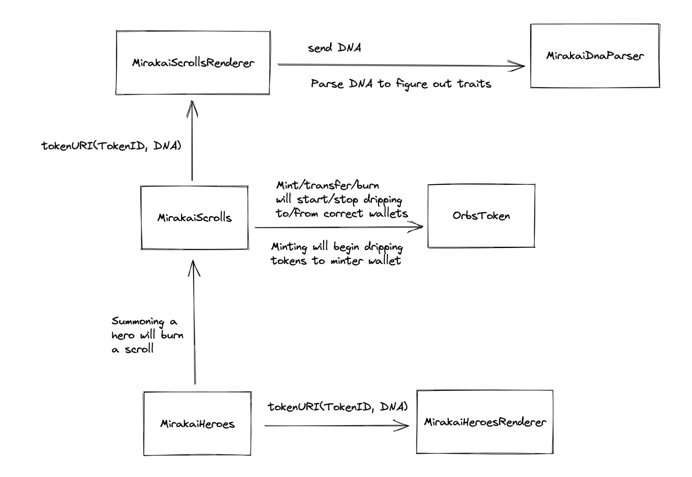

# Mirakai

Here you will find the following contracts:

`MirakaiScrolls.sol` - This is the main ERC721 contract for the on-chain scrolls. This is where scrolls will be minted and the on-chain re-rolling logic happens (details at the top of the contract). When a scroll is minted, a uint256 DNA is generated and stored in this contract which dictates the scrolls traits. `tokenURI()` will point to a separate upgradeable scroll renderer.

`MirakaiScrollsRenderer.sol` - This is the scrolls renderer that creates the scroll SVG and metadata. It is a little ugly and chaotic because it is essentially jsonify written in solidity... pain. I also had to save our custom font via SSTORE2.

`MirakaiDnaParser.sol` - This is a standalone contract that takes in DNA (uint256) and parses it into specified traits. We made this a standalone contract in case other projects wanted to compose Mirakai - you can simply parse DNA by calling this contract vs calling an ERC721 contract with other functionality.

`MirakaiHeroes.sol` - This is the ERC721 contract used to summon a hero by burning a scroll. NOTE: once a hero is summoned, the DNA will then be saved in this contract and deleted from the scrolls contract. This makes the most sense as DNA should only exist in the contract where the tokens exist. `tokenURI()` will point to a separate upgradeable heroes renderer.

`MirakaiHeroesRenderer.sol` - This is a simple renderer that points to our live layering engine. We made this upgradeable incase we want to entertain the idea of layering these on-chain (no promises for now). [More details on our renderer here.](https://pitch.com/public/dccab607-98fe-4e8d-81b3-a250d01fdbb8/d0979f30-a155-4e91-bcf2-1d7c93c6b690)

`OrbsToken.sol` - This the ERC20 that implements GIGADRIP20 - the dripping token. Once a scroll is minted, transfered, or burned, tokens will drip accordingly to the proper wallets. Watch your tokens auto accumulate in your wallet per block.

Contracts are deployed via forge scripting (check `script`) and initialized via hardhat (check `initialize-scripts/`). We initialize via hardhat as we have to save all the layers which is easier in JS as we don't run into stack too deep errors.

# Bug Bounty

We will be running a bug bounty - any bugs, exploits, or efficiency upgrades. Depending on the severity of your change, we will allocate mintlist spots, freemints, or ETH bounties (after mint).

Bugs found in [DRIP20/GIGADRIP20](https://github.com/0xBeans/DRIP20) are also included!

We may also include better testing or test cases that increase coverage in this bounty. We will not reward adding different tests that test the same functionality already tested.

Get your coding hats on! I've left in some easy changes ;) Make sure ALL foundry tests pass.

Submit either an issue or pull request!

PLEASE READ BELOW.

# Disclaimers

Before you big brains roast me about pseudo-randomness and exploits, I'm well aware of the pitfalls of using `keccak256()` to derive randomness. There were 3 implementations I was thinking about for generating DNA and re-rolling traits.

1. Chainlink. Request a number from VRF every mint/re-roll.
2. Signed random number passed in from our servers.
3. Using onchain pseudo-randomness.

Chainlink is infeasible for projects where requesting rng is required many times. It will cost a shit ton of money from the dev wallet and also spike gas costs for every mint/re-roll by 200k gas, which essentially defeats the purpose of on-chain re-rolling. 

Signed random number was something I was really considering as it is impossible to exploit, however, it requires a centralized entity that MUST be running at all times. Our end goal is to relinquish all ownership and just have this project run by itself for the most part (maybe have the hero renderer running, but it'll be opensource so anyone can run it) ~ohhh hyperstructure~. Having such a crucial part of the project rely on centralized random numbers signed by our private key was something that was not ideal and something I did not move forward on.

Although on-chain pseudo-randomness isn't completely random, it seemed like the best solution for our goals (contracts running entirely by themselves without interference from us, decentralized, super cheap re-rolling and fully onchain). I tried to increase entropy by adding a private var `_seed` that is used when generating random numbers. There is an owner function where I can completely change the `_seed` if I see any funny business (will renounce ownership after the project has been running smoothly) but ANYONE can increment the seed (my attempt to increase entropy) at any point -  seed is also incremented on mint/re-roll. Im also preventing contracts from re-rolling/minting to make it harder to game the rng by reverting txns that are desired random numbers. 

There are still concerns with flashbots potentially gaming RNG but I feel this is a small majority and this pros outweight the cons.

# Gas usage

check `gas-report.txt`
